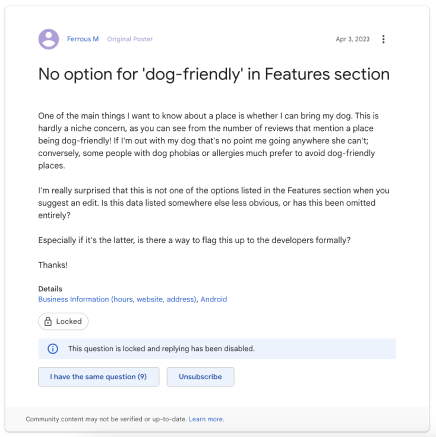

<h2 align="center">
  SBA_308A_JavaScript_Web_Application  
</h2>

<h3 align="center">
  Doogie - Enhancing Dog Owners' Dining Joy!
</h3>

## Development Time
> **Design Concept and Create Architecture:** 2024.04.06.   
> **Computation:** 2024.04.06. ~ 2024.04.07.

## Live Demo

> **First Trial** :   
> **Rendered Proto** : TBA

## Designer and Developer

|      Hannah Moon       |                                                                                                                        
| :------------------------------------------------------------------------------: |  
|       |  
|   [@Hannah-Moon](https://github.com/Hannah-Moon)   |   

## Problem to solve

As a fellow dog lover, I totally get the struggle of finding dog-friendly restaurants using Google's search services alone. Those scattered online directories like BringFido.com and sifting through pet-friendly tags on Yelp can feel like a bit of a hassle! But fear not! With a handy solution like Doogie, dog owners can breeze through the process and easily sniff out restaurants where they can enjoy a meal with their furry companions. Happy dining!  

                   
[@Source information](https://support.google.com/maps/thread/209225954/no-option-for-dog-friendly-in-features-section?hl=en)

---
## Tools 🛠️

### Environment

             

### Development

---
## Key Feature 📦

### ⭐️ Geolocator 
- Geolocate your cullet location

### ⭐️ Don't bombard with information
- Suggest only the top 5 restaurants nearby

---
## New Approach 📦
### Object Oriented Thinking 
- Gather requirements: The problem to solve
- Describe the application: how people are using
- Identify the main objects: identifying actual classes
- Describe the interactions: Understand each object and behavior the needs to have and when they interact with other objects
- Create class diagram: Visual diagram of classes in the applications. 

---
## Design Process 🖌️
The design was created in Figma.

|  |  

---
## Reflection 🔎

| Question   | Answer                            |
| -----------| --------------------------------- | 
| 1. What could you have done differently during the planning stages of your project to make the execution easier? | 
In the planning phase, I had to dive into the project without fully grasping the new technique, leading to spending an excessive amount to take online courses to establish knowledge. Unfortunately, this left insufficient time for coding. As a result, I still need to dedicate time to implementing a few features to align with the design file. | 
| 2. Were there any requirements that were difficult to implement? What do you think would make them easier to implement in future projects? | 
Reflecting on my recent experiences, I found that organizing files using modules and imports was an extremely challenging aspect of my work. Despite my efforts, I struggled to streamline the process efficiently. This difficulty stemmed from the intricate interplay between various components and the intricate nature of managing dependencies. |
| 3. What would you add to, or change about your application if given more time? | 
Upon reflection, I realize that I should allocate more time to Geolocation work in the future. It is an area where additional investment of time and effort would yield significant benefits and enhance the quality of my projects. |
| 4. Use this space to make notes for your future self about anything that you think is important to remember about this process, or that may aid you when attempting something similar again? | You did incredibly well! Despite all the challenges you encountered, you didn't give up; you persevered with remarkable resilience and determination in the face of adversity. You should be proud of your ability to overcome obstacles and stay steadfast in pursuit of your goals. Keep up the fantastic work, and remember to celebrate your victories, no matter how small they may seem! |
